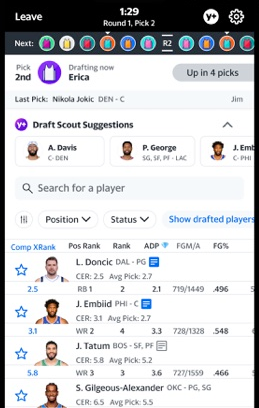
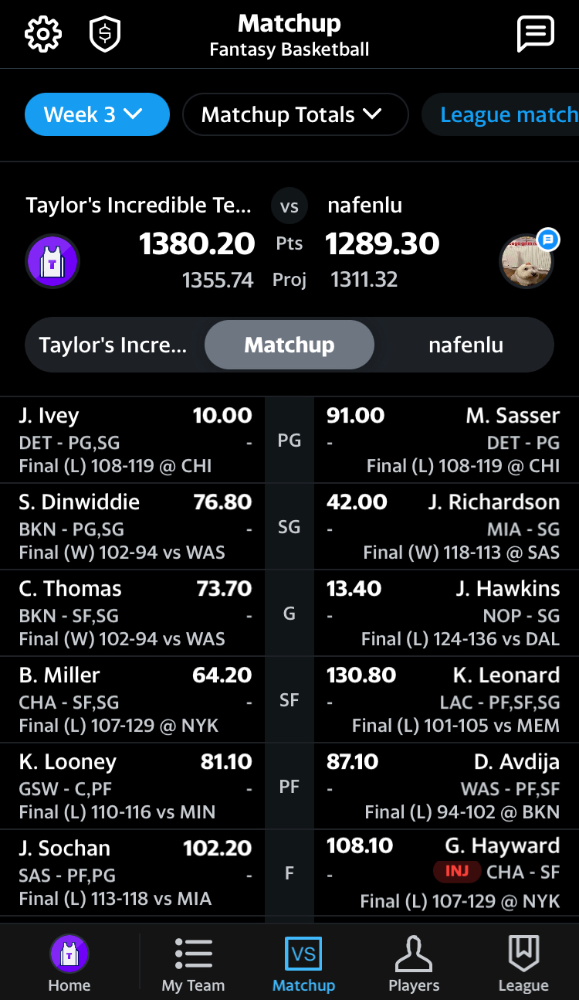
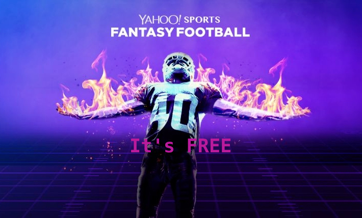
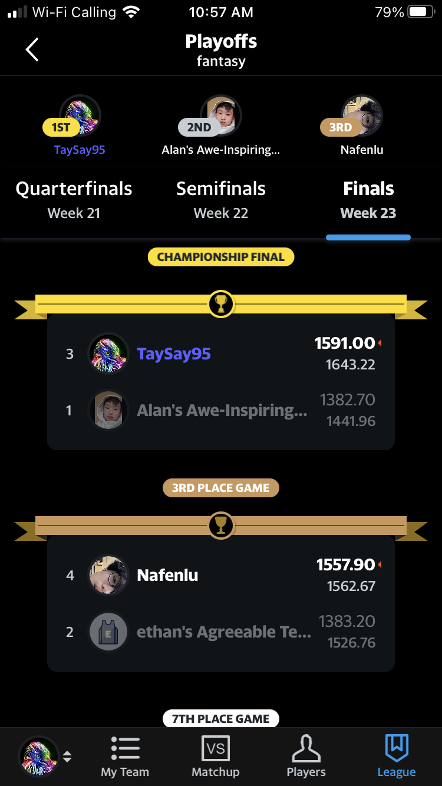

FAVOURITE THINGS PROJECT
# Yahoo Fantasy App

---

* Yahoo! Fantasy is a fantasy sports app developed by Yahoo! Sports, a division of Yahoo!
* Estimated ~10M users
* Games available for Basketball, Football, Baseball, Soccer, and more

---

# Where is the Yahoo! Main Office?

---
# Yahoo! Main Office
Yahoo! has many offices around the world, but their [headquarters](https://maps.app.goo.gl/six4XxV32gqEkZds9) is in New York City

---

# Why I like Yahoo! Fantasy?

---

### Why I like Yahoo Fantasy?
* I enjoy watching sports
* Fantasy lets me draft & manage my own team
* I can have many teams from leagues like the NBA, NHL, and NFL
* It's a fun hobby
* I get to have friendly competition with friends

    * The week when I 
←beat​ ​Nathan

---

# Where can you get Yahoo! Fantasy?

---
###### Where can you get Yahoo! Fantasy?

* Yahoo! Fantasy is available on the App Store and Google Play
* You can also play Fantasy through the [Yahoo! Fantasy Website](https://sports.yahoo.com/fantasy/)
---

# How much does it cost?

---

---

# But...
* You have to pay if you want to make real bets
* There is an option to subscribe to Fantasy Plus for $34.99/yr
    * Gives more advanced stats and suggestions

---

# Who are Yahoo! Fantasy's Competitors?

---

# Competitors
Competitors of Yahoo! Fantasy include:
* [ESPN Fantasy Games](https://www.espn.com/fantasy/)
* [CBS Sports Fantasy](https://www.cbssports.com/fantasy/)
* [Sleeper](sleeper.com)
* [NFL Fantasy App](fantasy.nfl.com)

---

# Fun Facts

---

### Fun Facts
* Yahoo! first offered Fantasy Football Leagues in July 1999
* Yahoo! Fantasy is the #1 rated fantasy sports app
* Yahoo! Fantasy uses a variety of sources ([Rotowire](https://www.rotowire.com/), [Rotoworld](https:///www.rotoworld.com), [ESPN](https://www.espn.com/fantasy/), & more) to ensure accurate information and stats
* I placed first last year in my Yahoo! Basketball Fantasy league between my friends
    * Me placing ahead of everyone including Nathan→

---

# The End